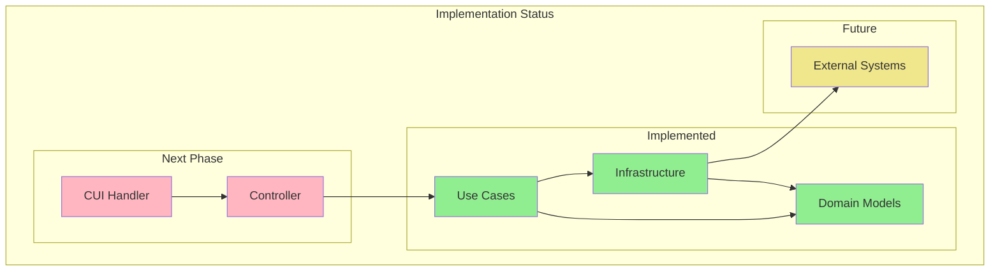

# System Patterns

## System Architecture

### Layer-based Architecture
1. Domain Layer (domain/models/)
   - ✅ Core business entities as data classes
   - ✅ Schema validation for DataFrames
   - ✅ Pure data representation

2. Infrastructure Layer (infrastructure/)
   - ✅ Database operations (SQLite implemented)
   - ✅ File operations (TSV reader implemented)
   - [ ] S3 integration (pending)
   - ✅ Data conversion to/from domain models

3. Use Case Layer (usecase/)
   - ✅ Pure business logic implementation (get_latest_user_actions)
   - ✅ Functional programming approach
   - [ ] Input validation separation
   - ✅ No side effects

4. Controller Layer (controller/)
   - [ ] Orchestration of use cases
   - [ ] Infrastructure coordination
   - [ ] Process flow management

5. Handler Layer (handler/cui/)
   - [ ] Command-line interface
   - [ ] Parameter parsing
   - [ ] Controller invocation

## Key Technical Decisions

### Data Handling
- ✅ Spark DataFrame as primary data structure
  - Implemented in UserActionDataFrame with schema validation
  - Property-based access through df property
  - Strict schema checking in constructor
- ✅ Strong typing with pyright
  - Type hints on all function parameters
  - Dataclass usage for domain models
  - Iterator typing in SQLite reader

### Code Organization
- ✅ Clear separation of concerns
- ✅ Functional core, imperative shell
- [ ] Validation-logic separation
- ✅ Private functions with underscore prefix

## Design Patterns in Use

### Domain-Driven Design Patterns
- ✅ Rich Domain Models (UserAction implementation)
- ✅ Immutable Data Classes (UserAction with dataclass)
- ✅ Value Objects (UserActionDataFrame with DataFrame)
- ✅ Repository Pattern (TSV and SQLite implementations)

### Functional Patterns
- ✅ Pure Functions (implemented in get_latest_user_actions)
- ✅ Immutable Data (UserAction dataclass)
- ✅ Function Composition (window functions)
- [ ] Separated Validation (pending)

### Testing Patterns
- ✅ Arrange-Act-Assert (implemented in test_get_latest_user_actions)
- ✅ Business Rule Documentation (Japanese test names)
- ✅ Parallel Test Structure (usecase tests)
- ✅ Isolated Unit Tests (Spark fixtures)

## Component Relationships

### Data Flow

### Dependency Rules
1. ✅ Domain Models have no dependencies
2. ✅ Use Cases depend on Domain Models
3. ✅ Infrastructure depends on Domain Models
4. [ ] Controllers orchestrate Use Cases and Infrastructure
5. [ ] Handlers depend on Controllers

## Critical Implementation Paths

### Data Processing Flow
1. [ ] CLI input parsing (pending)
2. ✅ Parameter validation (implemented in DataFrame constructors)
3. [ ] Controller orchestration (pending)
4. ✅ Business logic execution (window functions implemented)
5. ✅ Infrastructure operations (TSV and SQLite readers implemented)

### Validation Flow
1. ✅ Schema validation in domain models (implemented in UserActionDataFrame)
2. [ ] Input validation in separate functions (next phase)
3. [ ] Business rule validation in use cases (in planning)
4. [ ] External system validation in infrastructure (future phase)

### Error Handling Path
1. ✅ Schema validation errors (DataFrame constructor validation)
2. [ ] Business rule violations (to be implemented with use cases)
3. [ ] Infrastructure errors (planned for next phase)
4. [ ] CLI parameter errors (part of handler implementation)
5. [ ] User feedback system (planned for CLI layer)
