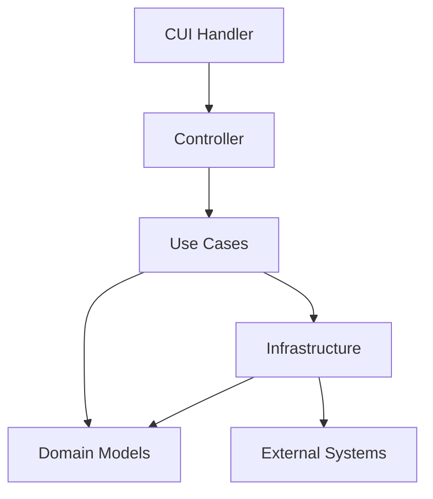

# System Patterns

## System Architecture

### Layer-based Architecture
1. Domain Layer (domain/models/)
   - Core business entities as data classes
   - Schema validation for DataFrames
   - Pure data representation

2. Infrastructure Layer (infrastructure/)
   - S3 data access implementations
   - Database operations
   - Data conversion to/from domain models
   - No business logic allowed

3. Use Case Layer (usecase/)
   - Pure business logic implementation
   - Functional programming approach
   - Input validation separation
   - No side effects

4. Controller Layer (controller/)
   - Orchestration of use cases
   - Infrastructure coordination
   - Process flow management

5. Handler Layer (handler/cui/)
   - Command-line interface
   - Parameter parsing
   - Controller invocation

## Key Technical Decisions

### Data Handling
- Spark DataFrame as primary data structure
- Strong typing with pyright
- Schema validation in constructors
- Property-based DataFrame access

### Code Organization
- Clear separation of concerns
- Functional core, imperative shell
- Validation-logic separation
- Private functions with underscore prefix

## Design Patterns in Use

### Domain-Driven Design Patterns
- Rich Domain Models
- Immutable Data Classes
- Value Objects (DataFrames)
- Repository Pattern (Infrastructure)

### Functional Patterns
- Pure Functions
- Immutable Data
- Function Composition
- Separated Validation

### Testing Patterns
- Arrange-Act-Assert
- Business Rule Documentation
- Parallel Test Structure
- Isolated Unit Tests

## Component Relationships

### Data Flow

### Dependency Rules
1. Domain Models have no dependencies
2. Use Cases depend on Domain Models
3. Infrastructure depends on Domain Models
4. Controllers orchestrate Use Cases and Infrastructure
5. Handlers depend on Controllers

## Critical Implementation Paths

### Data Processing Flow
1. CLI input parsing
2. Parameter validation
3. Controller orchestration
4. Business logic execution
5. Infrastructure operations

### Validation Flow
1. Schema validation in domain models
2. Input validation in separate functions
3. Business rule validation in use cases
4. External system validation in infrastructure

### Error Handling Path
1. Schema validation errors
2. Business rule violations
3. Infrastructure errors
4. CLI parameter errors
